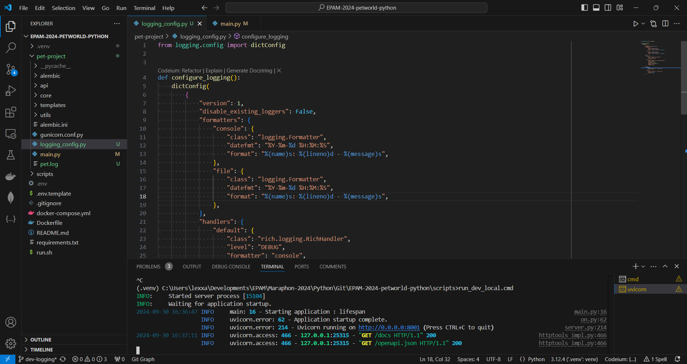

## Local setup guide

***
> This guide should be used for local setup and testing only purposes. Don't use any credentials you might bump into in files like `docker-compose.yml` in production.

1. Based on `.env.template`, create your own `.env` file and fill in all the possible entries. `APP_CONFIG__DB__URL` is mandatory to start the project and apply initial migrations.
2. Run `docker-compose up` command and make every container is up-and-running
3. Apply the latest migrations you have in `alembic/versions` folder. For this use `alembic upgrade head` command.
4. Follow `localhost:8000/docs` to have a view of APIs available to do further dev testing

## Homework
0. Setup the project locally and make sure it's running without any issues
1. Configure and implement logging functionality so that every request is logged into console and separate file named `pet.log`. This logging data should contain:
   * Request URL
   * Request method
   * Status code
   * Total time required to complete the request
2. _Additionally_ you could implement the same logging functionality, but using decorator approach, so that codebase is split to corresponding modules and looks concise.

## Homework Solution

1. .env moved to level of Docker env
2. Configured logging_config

3. Logging HTTP request (middleware)

4. Log request

Postman:

Log postman /me:

Decorator:

